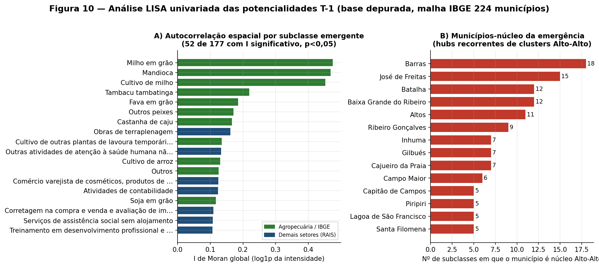
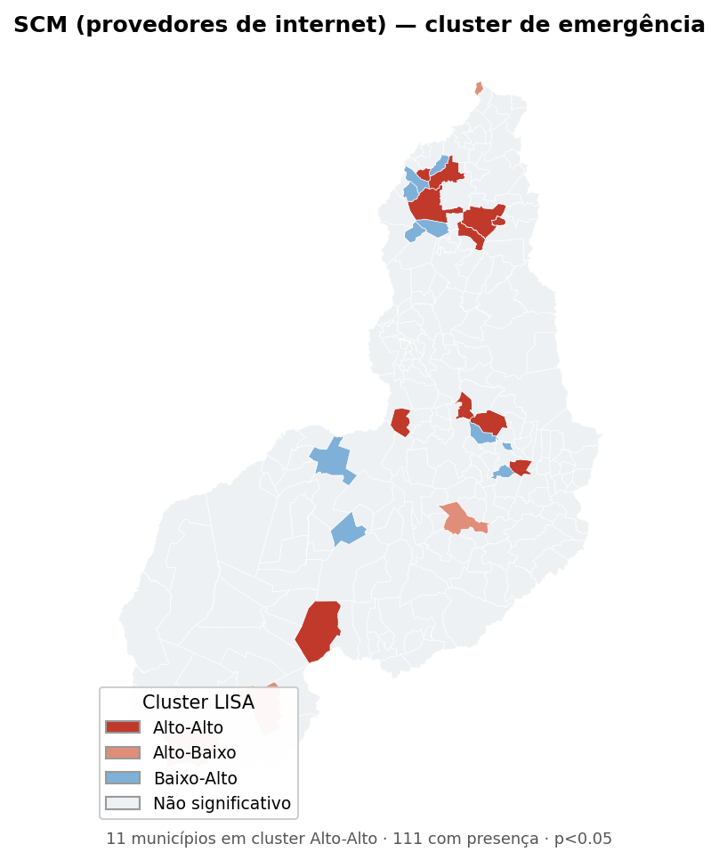
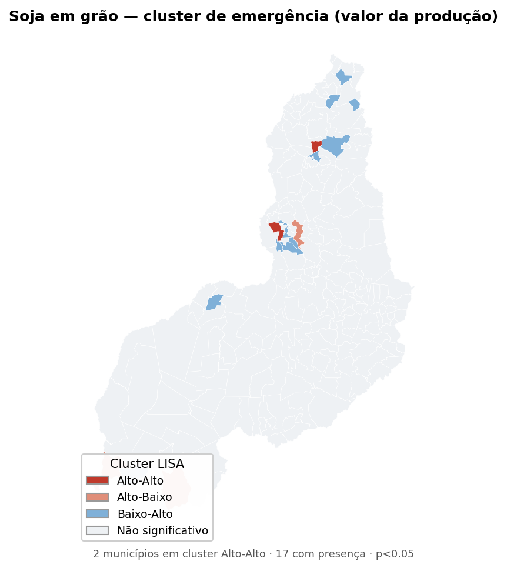
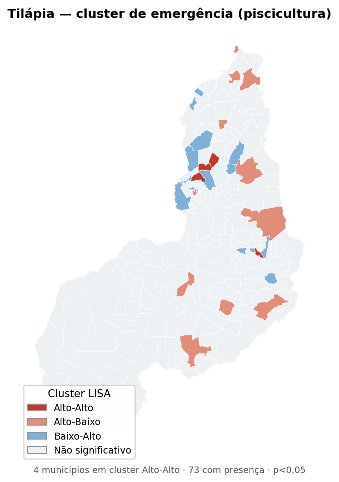
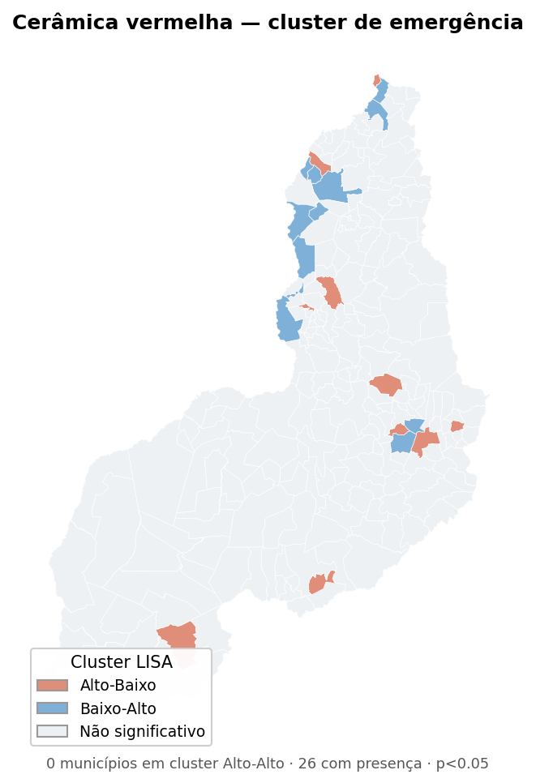
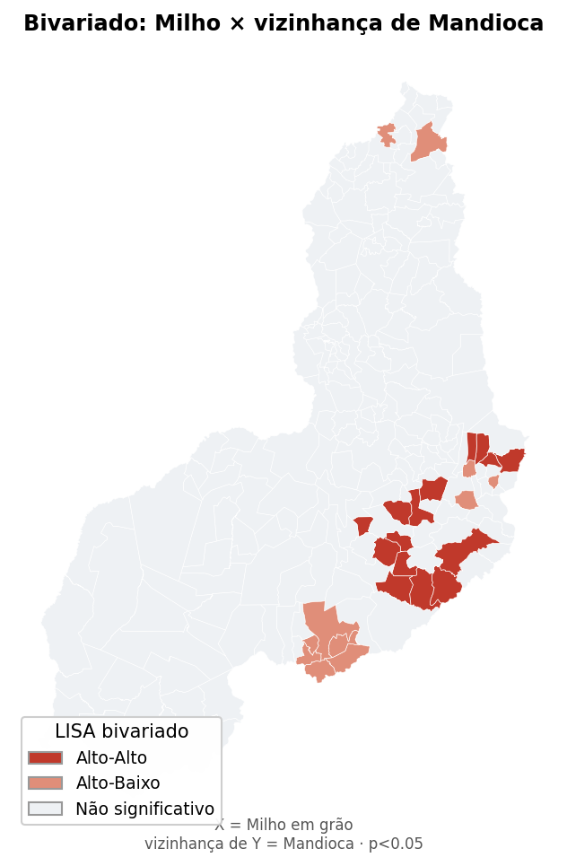
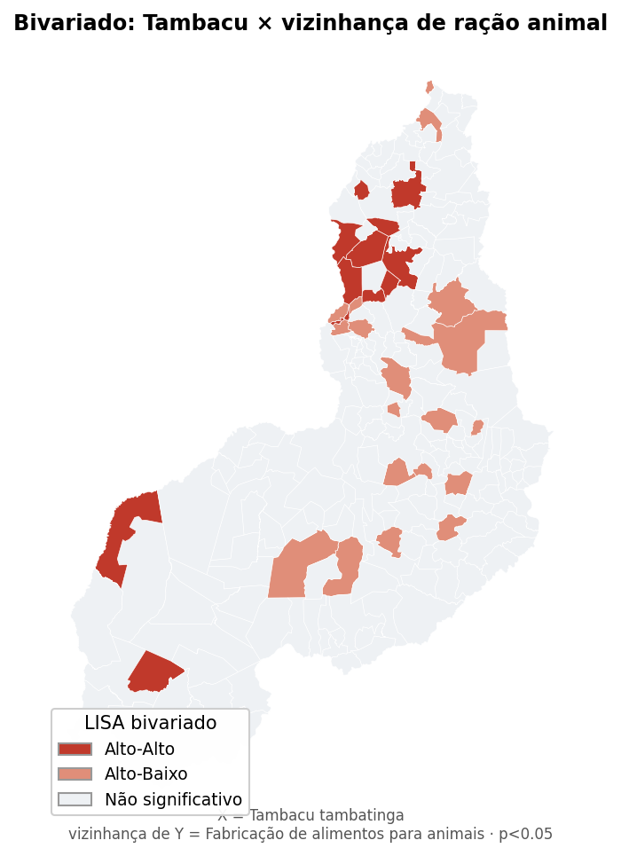
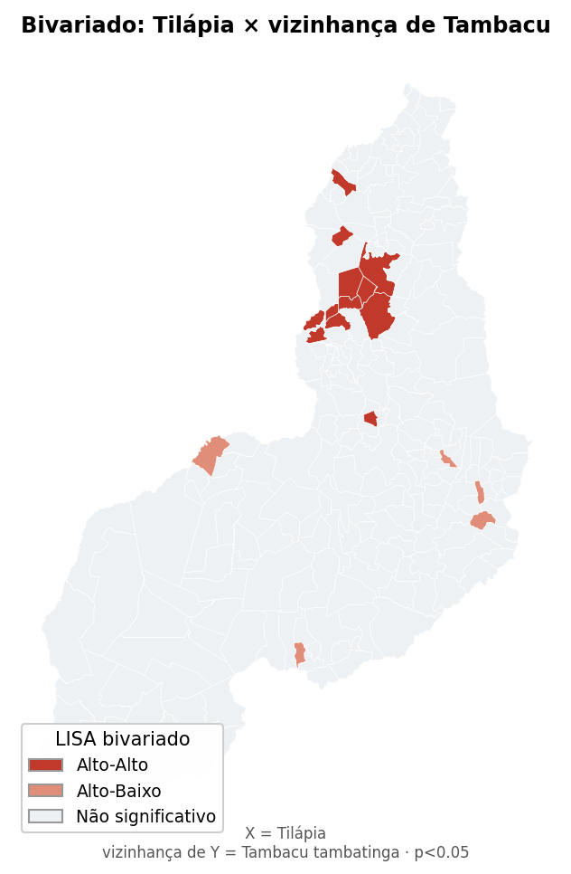

---

## 7. Análise espacial LISA/Moran da emergência T-1

Esta seção aplica autocorrelação espacial à base depurada (5.673 emergências candidatas), respondendo à pergunta que a análise descritiva deixa em aberto: **a emergência de um setor é um evento isolado ou forma manchas contíguas no território?** Um cluster Alto-Alto indica que municípios com forte emergência de determinada atividade estão cercados por vizinhos igualmente fortes — assinatura de um processo regional, não de um acaso municipal.

### 7.1 Nota sobre a malha municipal

A malha oficial IBGE dos 224 municípios não estava disponível nesta sessão. Utilizou-se a malha pública de referência (223 municípios), na qual **Nazária (IBGE 2206720) foi reconstruída** a partir do polígono pré-2013 de Teresina — que ainda continha seu território. A partição resultou em Nazária ≈ 363 km² e Teresina ≈ 1.395 km², coincidindo com as áreas oficiais pós-desmembramento (363 e 1.391 km²). **A fronteira interna é aproximada** (corte latitudinal, não a linha administrativa real); para contiguidade Queen isso é suficiente, pois Nazária vizinha apenas Teresina, Palmeirais e municípios do entorno metropolitano — relações preservadas. Recomenda-se, na versão final, substituir pela malha `PI_Municipios_2025.shp`.

### 7.2 Parâmetros

Mantidos os padrões do projeto: contiguidade **Queen row-standardized**, transformação **log1p** da intensidade, **999 permutações**, **seed 42**, significância **p < 0,05**, mínimo de **10 municípios** presentes para avaliação univariada e **5 copresentes** para pares bivariados. A intensidade é o estoque no ano final (vínculos para RAIS; valor da produção ou rebanho para IBGE), tratada **coluna a coluna**, já que só é comparável dentro da mesma subclasse. Clusters Baixo-Baixo formados por ausência conjunta (município zero cercado de zeros) foram descartados por não informarem sobre emergência.

### 7.3 Resultado univariado: 52 setores com estrutura espacial

Das **177 subclasses** com presença em ≥ 10 municípios, **52 (29%) apresentam I de Moran global significativo**. O I médio dessas é 0,064, mas os líderes são muito mais concentrados:

| Subclasse | Fonte/Seção | Municípios | I global | Municípios AA |
|---|---|---:|---:|---:|
| Mandioca | IBGE/PAM | 37 | 0,475 | 25 |
| Milho em grão | IBGE/PAM | 42 | 0,460 | 26 |
| Cultivo de milho | A – Agropecuária | 23 | 0,451 | 7 |
| Tambacu tambatinga | IBGE/PPM | 74 | 0,215 | 19 |
| Fava em grão | IBGE/PAM | 32 | 0,188 | 10 |
| Outros peixes | IBGE/PPM | 64 | 0,175 | 16 |
| Obras de terraplenagem | F – Construção | 22 | 0,162 | 3 |
| **SCM (provedores de internet)** | J – Info./Com. | — | 0,08 | 10 |
| Construção de rodovias e ferrovias | F – Construção | 53 | 0,113 | 7 |

**A estrutura espacial mais forte é agropecuária** — mandioca, milho e as espécies de piscicultura formam manchas nítidas. Isso é coerente: cultivo e criação obedecem a solo, clima e bacias hidrográficas, que são contínuos no espaço. Atividades de serviço e comércio, sujeitas a decisões empresariais dispersas, têm I bem menor — mas o **SCM se destaca como o único serviço com clusterização relevante**, confirmando a hipótese levantada na análise descritiva: a expansão dos provedores regionais de internet segue corredores, não pontos isolados.

### 7.4 Os municípios-núcleo da emergência

Cruzando todos os clusters Alto-Alto, emergem **hubs recorrentes** — municípios que são núcleo de emergência para muitas subclasses ao mesmo tempo:

| Município | Nº de subclasses em que é núcleo AA | Leitura |
|---|---:|---|
| Barras | 18 | Polo do norte-central, difusão múltipla |
| José de Freitas | 15 | Entorno metropolitano de Teresina |
| Batalha | 12 | Norte, agropecuária + piscicultura |
| Baixa Grande do Ribeiro | 12 | Núcleo do Cerrado (soja, milho) |
| Altos | 11 | Região metropolitana |
| Ribeiro Gonçalves | 9 | Fronteira agrícola do sudoeste |
| Gilbués | 7 | Cerrado sul |

Dois eixos geográficos se desenham: **o entorno metropolitano de Teresina** (José de Freitas, Altos, Batalha — piscicultura e serviços) e **a fronteira agrícola do sudoeste/Cerrado** (Baixa Grande do Ribeiro, Ribeiro Gonçalves, Gilbués — grãos).

Os mapas a seguir ilustram os quatro vetores-chave.

### 7.5 Resultado bivariado: 112 associações espaciais entre setores emergentes

O Moran bivariado testa se a emergência de X num município se associa à emergência de Y na sua vizinhança — revelando **encadeamentos produtivos que se difundem juntos**. Foram testadas seis âncoras (SCM, cerâmica, soja, milho, tilápia, tambacu) contra todas as demais subclasses; **112 pares** resultaram significativos com ao menos um núcleo Alto-Alto. Os mais fortes:

| Âncora X | Vizinhança Y | Copres. | I bivariado | Núcleos AA |
|---|---|---:|---:|---:|
| Milho em grão | **Mandioca** | 17 | 0,274 | 15 |
| Tambacu | Corretagem de imóveis | 5 | 0,191 | 9 |
| Milho | Assistência social sem alojamento | 6 | 0,189 | 12 |
| Tambacu | **Produção de ovos** | 9 | 0,177 | 10 |
| Tambacu | **Hipermercados** | 8 | 0,177 | 10 |
| Cerâmica | Lojas de conveniência | 6 | 0,174 | 6 |
| Tambacu | **Fabricação de alimentos para animais** | 10 | 0,126 | 11 |
| Tilápia | **Tambacu tambatinga** | 28 | 0,093 | 11 |
| Tilápia | **Cerâmica vermelha** | 11 | 0,090 | 8 |

Três encadeamentos merecem destaque analítico:

1. **Grãos do Cerrado (Milho ↔ Mandioca, I = 0,274)** — a associação bivariada mais forte de todo o conjunto. Onde o milho emerge, a mandioca emerge no entorno: é o avanço conjunto da lavoura temporária na mesma fronteira agrícola, o padrão espacialmente mais estruturado das potencialidades T-1.

2. **Complexo da piscicultura (Tambacu ↔ ração animal ↔ produção de ovos; Tilápia ↔ Tambacu).** A criação de peixes emerge acompanhada, na vizinhança, de **fabricação de alimentos para animais** e **produção de ovos** — indício de um arranjo produtivo local nascente, em que a aquicultura puxa cadeias de fornecimento a montante. Este é o achado com maior interesse para política de desenvolvimento: não é um setor isolado, é um **cluster agroindustrial em formação** no entorno de Teresina e no norte do estado.

3. **Cerâmica ↔ piscicultura (I = 0,090).** A cerâmica vermelha e a tilápia compartilham o mesmo cinturão espacial — ambas dependem de várzeas e recursos hídricos. A coincidência sugere um território (o entorno metropolitano e o médio Parnaíba) que concentra simultaneamente indústria de base e aquicultura emergentes.

### 7.6 Síntese espacial

A emergência T-1 do Piauí, uma vez depurada e mapeada, não é aleatória: **concentra-se em dois territórios funcionais**. O **sudoeste do Cerrado** (Baixa Grande do Ribeiro, Ribeiro Gonçalves, Gilbués, Bom Jesus) é o núcleo da emergência de grãos — soja, milho, sorgo, mandioca —, com a associação bivariada mais forte do conjunto. O **entorno metropolitano de Teresina e o norte** (José de Freitas, Altos, Batalha, Barras) é o núcleo de um **complexo aquícola-industrial nascente**, em que piscicultura, ração animal, cerâmica e comércio alimentar emergem de forma espacialmente acoplada. O SCM, por fim, é o único serviço com difusão espacial própria, seguindo corredores no norte-central.

Para a política regional, a leitura é direta: as potencialidades T-1 com maior densidade e maior estrutura espacial **não são as que aparecem no topo da contagem bruta de vínculos** (dominada por reclassificação administrativa), e sim os arranjos agro e aquícolas do Cerrado e do entorno de Teresina — territórios onde a emergência é, ao mesmo tempo, econômica, contígua e encadeada.

### 7.7 Arquivos gerados

- `out_lisa/moran_global_univariado.csv` — I global e contagem de quadrantes por subclasse (177 avaliadas).
- `out_lisa/lisa_univariado_clusters.csv` — municípios em cluster local significativo, por subclasse.
- `out_lisa/moran_bivariado_pares.csv` — 112 pares bivariados significativos.
- `out_lisa/lisa_bivariado_clusters.csv` — núcleos Alto-Alto bivariados.
- `figuras/uni_*.png`, `figuras/biv_*.png`, `figuras/fig10_lisa_resumo.png` — mapas e síntese.
- Scripts: `spatial_utils_t1.py`, `lisa_univariado.py`, `lisa_bivariado.py`, `mapas_lisa.py`.
